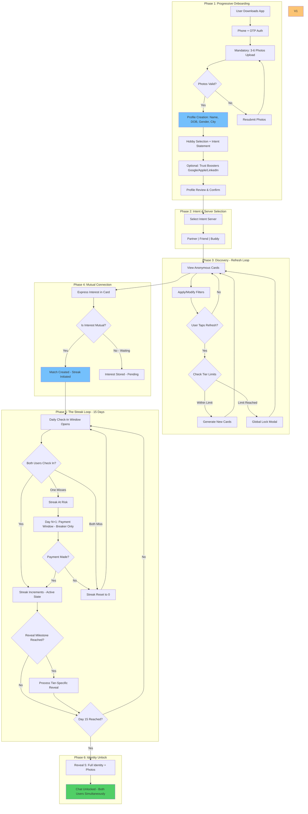
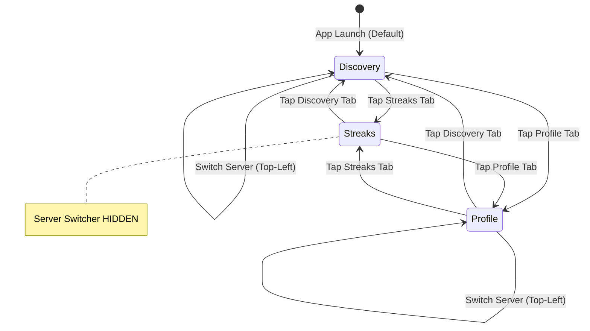

# Unora — User Flow & Logic Document

**Version:** 1.0  
**Date:** January 2026  
**Classification:** Internal / Engineering / Product  
**Source:** [Unora PRD v1.0](file:///c:/Unora/Founder_Product_docs/Unora_PRD.md)

---

## 1. High-Level Macro Flow



---

## 1.1 Navigation Architecture (3-Tab Hybrid Model)

> [!IMPORTANT]
> Unora uses a **rigid 3-Tab Bottom Navigation** with a **Top-Left Server Switcher**. The bottom tabs represent app sections; the server switcher controls context.

---

### 1.1.1 Fixed Bottom Navigation Bar

The bottom navigation is **always visible** on all top-level screens. It contains exactly 3 tabs:

```
┌─────────────────────────────────────────────────────────────────┐
│                                                                 │
│                      [ Screen Content ]                         │
│                                                                 │
├─────────────────────────────────────────────────────────────────┤
│                                                                 │
│   ┌─────────────┐   ┌─────────────────┐   ┌─────────────┐       │
│   │     🔥      │   │    [Logo]       │   │     👤      │       │
│   │   Streaks   │   │   Discovery     │   │   Profile   │       │
│   │             │   │    ═══════      │   │             │       │
│   └─────────────┘   └─────────────────┘   └─────────────┘       │
│                                                                 │
│                     ↑ Default/Active Tab                        │
└─────────────────────────────────────────────────────────────────┘
```

| Position | Tab | Screen Reference | Icon | Behavior Type |
|----------|-----|------------------|------|---------------|
| **Left** | Streaks | Screen 11 — Streaks Dashboard | Flame / Fire | **Global Aggregator** |
| **Center** | Discovery | Screen 09 — Discovery Feed | Unora Logo / Cards | **Contextual** |
| **Right** | Profile | Screen 21 — User Profile | User Avatar | **Contextual** |

---

### 1.1.2 Tab Behavior Types

#### Global Aggregator (Streaks Tab)

```
STREAKS TAB — GLOBAL AGGREGATOR
│
├── Shows: ALL active connections aggregated from ALL servers
│   ├── Partner connections (Terracotta accent)
│   ├── Friend connections (Teal accent)
│   └── Growth connections (Indigo accent)
│
├── Server differentiation: Visual only (left border color, icon)
│
├── Server Switcher: ✗ HIDDEN on this tab
│   └── Rationale: Filtering by server is unnecessary and confusing
│       when all connections are already displayed
│
└── Entry point: From any other tab via Bottom Nav
```

#### Contextual (Discovery Tab)

```
DISCOVERY TAB — CONTEXTUAL (Server-Specific)
│
├── Shows: Potential matches for the CURRENTLY SELECTED SERVER ONLY
│   ├── Partner server → Shows potential partners
│   ├── Friend server → Shows potential friends
│   └── Growth server → Shows potential growth buddies
│
├── Server Switcher: ✓ VISIBLE on this tab (Top-Left)
│
└── Theme: Accent colors match active server
```

#### Contextual (Profile Tab)

```
PROFILE TAB — CONTEXTUAL (Server-Specific)
│
├── Shows: User's profile relevant to CURRENTLY SELECTED SERVER
│   └── Profile data is unified, but presentation context differs
│
├── Server Switcher: ✓ VISIBLE on this tab (Top-Left)
│
└── Theme: UI accent colors DYNAMICALLY change to match active server
    ├── Partner → Terracotta accents
    ├── Friend → Teal accents
    └── Growth → Indigo accents
```

---

### 1.1.3 Server Switcher Component

The **Server Switcher** is a dropdown/toggle in the **Top-Left corner** of the screen header.

```
┌─────────────────────────────────────────────────────────────────┐
│   🔥 Partner ▼                              Profile  ⚙️        │
│                                                                 │
│          ↑ Server Switcher (Top-Left)                           │
│          Tapping opens dropdown:                                │
│          ┌──────────────────┐                                   │
│          │ 🔥 Partner    ✓  │                                   │
│          ├──────────────────┤                                   │
│          │ 👋 Friend        │                                   │
│          ├──────────────────┤                                   │
│          │ 🎯 Growth        │                                   │
│          └──────────────────┘                                   │
│                                                                 │
└─────────────────────────────────────────────────────────────────┘
```

**Visibility Rules:**

| Screen / Tab | Server Switcher Visible? | Rationale |
|--------------|--------------------------|-----------|
| Discovery Tab | ✓ Yes | Server-specific content |
| Profile Tab | ✓ Yes | Server-specific theming |
| Streaks Tab | ✗ No | Global aggregator — server filter unnecessary |

---

### 1.1.4 Navigation State Diagram



---

### 1.1.5 Default States

| Scenario | Default Tab | Default Server |
|----------|-------------|----------------|
| Fresh app launch | Discovery | Partner |
| Return to app (backgrounded) | Last viewed tab | Last selected server |
| After completing onboarding | Discovery | Partner |

---

## 2. Detailed Logic Flows

---

### 2.A Onboarding & Progressive Verification

**PRD Reference:** [Section 10](file:///c:/Unora/Founder_Product_docs/Unora_PRD.md)

The onboarding flow uses a **Progressive Verification Model** where trust is earned through presence and consistency, not paperwork. There is no hard gate at onboarding. Personhood is verified through mandatory steps (phone + photos), and identity is optionally confirmed over time.

---

#### 2.A.1 Phone Authentication

```
┌─────────────────────────────────────────────────────────────────────────────┐
│ USER ACTION          │ User opens app for first time OR taps "Get Started" │
├──────────────────────┼──────────────────────────────────────────────────────┤
│ SYSTEM LOGIC         │ Present Phone + OTP authentication                   │
│                      │ ├── User enters phone number                         │
│                      │ ├── System sends 6-digit OTP                         │
│                      │ └── User enters OTP                                  │
├──────────────────────┼──────────────────────────────────────────────────────┤
│ VALIDATION           │ ├── Valid phone format (India: +91 10 digits)        │
│                      │ └── OTP matches within 5-minute window               │
├──────────────────────┼──────────────────────────────────────────────────────┤
│ OUTCOME              │ Phone verified → Proceed to Photo Upload             │
└──────────────────────┴──────────────────────────────────────────────────────┘
```

---

#### 2.A.2 Mandatory Photo Upload

```
USER ACTION:    User uploads photos
                │
                ▼
SYSTEM LOGIC:   Present photo upload grid
                ├── Minimum 3 photos required
                ├── Maximum 6 photos allowed
                └── At least one clear face photo required
                │
                ▼
┌───────────────────────────────────┐
│  [DIAMOND] Photos Valid?          │
└───────────────────────────────────┘
                │
        ┌───────┴───────┐
        │               │
        ▼               ▼
┌───────────────┐  ┌───────────────────────────────────────┐
│    ✓ YES      │  │               ✗ NO                    │
│               │  │                                       │
│ **Photo       │  │ **Validation Failed**                 │
│ validation    │  │                                       │
│ passed**      │  │ ├── Blur detected                     │
│               │  │ ├── No face detected                  │
│ Store photos  │  │ └── Insufficient photos               │
│ (private by   │  │                                       │
│ default)      │  │ User sees helpful message:            │
│               │  │ "Clear photos help build trust"       │
│ Proceed to    │  │                                       │
│ Profile       │  │ Retry option available                │
│ Creation      │  │                                       │
└───────────────┘  └───────────────────────────────────────┘
```

**Photo Requirements:**

| Requirement | Detail |
|-------------|--------|
| **Minimum** | 3 photos |
| **Maximum** | 6 photos |
| **Face Photo** | At least 1 clear face photo required |
| **Validation** | AI-assisted (blur detection, face presence) |
| **Privacy** | All photos private until Day 15 reveal |

**Privacy Messaging:**

> "Your photos stay hidden until Day 15. Only you can see them until then."

---

#### 2.A.3 Profile Creation (User-Provided Data)

```
┌─────────────────────────────────────────────────────────────────────────────┐
│ USER ACTION          │ User provides profile information                    │
├──────────────────────┼──────────────────────────────────────────────────────┤
│ REQUIRED FIELDS      │ All user-provided, all editable:                     │
│                      │ ├── Name (user-provided)                             │
│                      │ ├── Date of Birth (user-provided)                    │
│                      │ ├── Gender (user-provided)                           │
│                      │ ├── City and locality                                │
│                      │ └── Hobbies (minimum 2 with micro-descriptions)      │
├──────────────────────┼──────────────────────────────────────────────────────┤
│ OPTIONAL FIELDS      │ ├── Education                                        │
│                      │ ├── Profession                                       │
│                      │ ├── Religion / cultural background                   │
│                      │ └── Bio / intent statement                           │
├──────────────────────┼──────────────────────────────────────────────────────┤
│ VALIDATION           │ ├── Name: Required, 2-50 characters                  │
│                      │ ├── DOB: Required, age 18+                           │
│                      │ ├── Gender: Required selection                       │
│                      │ ├── City: Required                                   │
│                      │ └── Hobbies: Minimum 2 required                      │
├──────────────────────┼──────────────────────────────────────────────────────┤
│ STORAGE              │ All data encrypted at rest (AES-256)                 │
│                      │ All data marked PRIVATE by default                   │
├──────────────────────┼──────────────────────────────────────────────────────┤
│ OUTCOME              │ Profile created → Proceed to Optional Trust Boosters │
└──────────────────────┴──────────────────────────────────────────────────────┘
```

> [!NOTE]
> **No verification of Name/DOB/Gender at this stage.** These are user-provided and editable. Government ID verification (optional, post-trust) can lock these fields if user chooses.

---

#### 2.A.4 Optional Trust Boosters

```
┌─────────────────────────────────────────────────────────────────────────────┐
│ USER ACTION          │ User optionally adds trust signals                   │
├──────────────────────┼──────────────────────────────────────────────────────┤
│ OPTIONS              │ One-tap integrations (all optional):                 │
│                      │ ├── Google Sign-In (OAuth 2.0)                       │
│                      │ ├── Apple Sign-In                                    │
│                      │ └── LinkedIn Connect (OAuth 2.0)                     │
├──────────────────────┼──────────────────────────────────────────────────────┤
│ MESSAGING            │ "Add trust signals to your profile (optional)"       │
│                      │ "These are visible only to you"                      │
├──────────────────────┼──────────────────────────────────────────────────────┤
│ SKIP BEHAVIOR        │ User can skip → No penalty, proceed normally         │
├──────────────────────┼──────────────────────────────────────────────────────┤
│ OUTCOME              │ Optional step → Proceed to Profile Review            │
└──────────────────────┴──────────────────────────────────────────────────────┘
```

**Rules:**

- Trust boosters are **never gates** — users can skip without penalty
- Visible only to the user (not shown to potential matches)
- Multiple boosters can be connected
- Can also be added later via Settings

---

#### 2.A.4.1 Optional Personality Setup

```
┌─────────────────────────────────────────────────────────────────────────────┐
│ USER ACTION          │ User reaches personality setup step (post-trust      │
│                      │ boosters)                                            │
├──────────────────────┼──────────────────────────────────────────────────────┤
│ SYSTEM PRESENTATION  │ "Add personality context (optional)"                 │
│                      │                                                      │
│                      │ ├── Brief explanation: "Help others understand how   │
│                      │ │   you connect"                                     │
│                      │ ├── Primary CTA: "Get Started →"                     │
│                      │ └── Skip CTA: "I'll do this later"                   │
├──────────────────────┼──────────────────────────────────────────────────────┤
│ IF USER COMPLETES    │ ├── Answer 8-12 situational questions                │
│                      │ ├── Tap-based responses only (no free text)          │
│                      │ ├── System updates numeric personality state         │
│                      │ └── Proceed to Profile Review                        │
├──────────────────────┼──────────────────────────────────────────────────────┤
│ IF USER SKIPS        │ ├── **No penalty**                                   │
│                      │ ├── Proceed directly to Profile Review               │
│                      │ ├── Personality setup available later in Profile tab │
│                      │ └── Discovery NOT blocked                            │
├──────────────────────┼──────────────────────────────────────────────────────┤
│ OUTCOME              │ Optional step → Proceed to Profile Review (2.A.5)    │
└──────────────────────┴──────────────────────────────────────────────────────┘
```

**Rules:**
- Personality setup is **never a gate** — users can skip without penalty
- Skipping does NOT affect discovery, matching, or any core functionality
- Setup can be completed later via Profile tab
- No urgency language or "incomplete profile" messaging
- AI NEVER generates questions — all questions are system-defined

---

#### 2.A.5 Profile Review & Confirmation

```
USER ACTION:    User reviews complete profile
                │
                ▼
┌─────────────────────────────────────────────────────────────────────────────┐
│  PROFILE REVIEW SCREEN                                                      │
│                                                                             │
│  YOUR PROFILE:                                 ← All editable (tap to edit) │
│  ├── 👤 Name: Priya Sharma                                                  │
│  ├── 📅 Age: 26 (from DOB)                                                  │
│  ├── ⚧ Gender: Woman                                                        │
│  ├── 📍 City: Bangalore                                                     │
│  ├── 🎓 Education: MBA, IIM Bangalore                                       │
│  ├── 💼 Profession: Product Manager                                         │
│  ├── 📷 Photos: 4 photos uploaded (private until Day 15)                    │
│  └── 🎯 Hobbies: Yoga, Reading, Hiking                                      │
│                                                                             │
│  TRUST STATUS:                                                              │
│  ├── ✓ Phone verified                                                       │
│  ├── ✓ Photos submitted                                                     │
│  └── ○ Trust boosters: Google connected                                     │
│                                                                             │
│  [Continue to Server Selection]                                             │
└─────────────────────────────────────────────────────────────────────────────┘
                │
                ▼
SYSTEM LOGIC:   User confirms → Proceed to Server Selection
                │
                ▼
OUTCOME:        Profile complete → Enter Server Selection (Section 2.B)
```

---

#### 2.A.6 Onboarding Edge Cases

| Scenario | Handling |
|----------|----------|
| **Photos fail validation** | Clear guidance provided. Retry option. Cannot proceed without 3 valid photos. |
| **User skips trust boosters** | No penalty. Trust builds through behavior instead. |
| **User enters invalid DOB** | Age validation (18+). Clear error message if under 18. |
| **User abandons mid-flow** | Progress saved at each step. Resume from last completed step. |
| **Photo upload fails (network)** | Retry option. Cached photos preserved. |

---

#### 2.A.7 Verification States After Onboarding

Users proceed to Discovery with the following verification state:

```
┌─────────────────────────────────────────────────────────────────────────────┐
│  VERIFICATION STATUS (Post-Onboarding)                                      │
│                                                                             │
│  ✓ Phone verified                                                           │
│  ✓ Photos submitted (3-6)                                                   │
│  ✓ Photo quality verified (AI-powered)                                      │
│  ○ Trust boosters (optional — connected or skipped)                         │
│  ⏳ Behavioral trust (builds through streak completion)                     │
│  ○ Government ID (optional — available post-trust)                          │
│                                                                             │
│  "You're ready to discover. Trust builds through consistency."              │
└─────────────────────────────────────────────────────────────────────────────┘
```

---

### 2.B Server Selection & Discovery Logic

**PRD Reference:** [Section 11 & 12](file:///c:/Unora/Founder_Product_docs/Unora_PRD.md)

---

#### 2.B.1 Server Selection (Universal Switching)

```
┌─────────────────────────────────────────────────────────────────────────────┐
│              UNIVERSAL SERVER SWITCHING — ALL TIERS                         │
│                     Switch Anytime, Instantly                               │
└─────────────────────────────────────────────────────────────────────────────┘

USER ACTION:    User taps server tab
                │
                ▼
SYSTEM LOGIC:   Present server options (always accessible)
                │
                ├── 🔥 Looking for a Partner (Romantic)
                ├── 👋 Friend / Companion (Platonic)
                └── 🎯 Accountability / Growth Buddy (Goal-oriented)
                │
                ▼
┌───────────────────────────────────────────────────────────────────────────┐
│  **INSTANT SWITCH — NO RESTRICTIONS**                                     │
│                                                                           │
│  ├── Free users: Switch anytime ✓                                        │
│  ├── Plus users: Switch anytime ✓                                        │
│  └── Pro users:  Switch anytime ✓                                        │
│                                                                           │
│  No cooldown. No tier gating. No switching fee.                           │
└───────────────────────────────────────────────────────────────────────────┘
                │
                ▼
SYSTEM ACTION:  Load target server's discovery view
                │
                ├── Display cached batch (if exists for this server)
                └── OR display empty/locked state (if no cached batch)

**CONSTRAINTS:**
├── Matches NEVER cross servers
├── Refresh timer is GLOBAL (shared across all servers)
└── Connection slots are GLOBAL (shared across all servers)
```

---

##### Server Switch Experience

```
USER ACTION:    User switches from Dating → Friend server
                │
                ▼
┌───────────────────────────────────────────────────────────────────────────┐
│  [DIAMOND] Does Friend server have a cached batch?                        │
└───────────────────────────────────────────────────────────────────────────┘
                │
        ┌───────┴───────┐
        │               │
        ▼               ▼
┌───────────────────┐   ┌───────────────────────────────────────────────────┐
│      ✓ YES        │   │                      ✗ NO                         │
│                   │   │                                                   │
│ Display cached    │   │ ┌───────────────────────────────────────────────┐ │
│ Friend cards      │   │ │  [DIAMOND] Is Global Refresh available?      │ │
│                   │   │ └───────────────────────────────────────────────┘ │
│ User can browse   │   │         │                       │                 │
│                   │   │         ▼                       ▼                 │
│ Connect button:   │   │ ┌─────────────┐   ┌───────────────────────────┐   │
│ ├── Enabled if    │   │ │   ✓ YES     │   │          ✗ NO             │   │
│ │   slots open    │   │ │             │   │                           │   │
│ └── Disabled if   │   │ │ Show empty  │   │ **LOCKED SCREEN**         │   │
│     at capacity   │   │ │ state with  │   │                           │   │
│                   │   │ │ Refresh     │   │ "Refresh available in     │   │
│                   │   │ │ button      │   │ X hours"                  │   │
│                   │   │ │ enabled     │   │                           │   │
│                   │   │ └─────────────┘   │ (Global timer from last   │   │
│                   │   │                   │ refresh in ANY server)    │   │
│                   │   │                   └───────────────────────────┘   │
└───────────────────┘   └───────────────────────────────────────────────────┘
```

---

#### 2.B.2 The Refresh & Filter Loop (Critical) — GLOBAL LOCKS

```
┌─────────────────────────────────────────────────────────────────────────────┐
│        DISCOVERY: THE GLOBAL DOUBLE-LOCK SYSTEM (FOCUS + SCARCITY)          │
│              REFRESH IS SINGLE SOURCE OF TRUTH — ACROSS ALL SERVERS         │
└─────────────────────────────────────────────────────────────────────────────┘

⚠️  CRITICAL: Both locks are GLOBAL. They persist across ALL server switches.
    A refresh in Dating locks Friend & Growth. Slots are shared account-wide.

USER ACTION:    User views Discovery screen (any server)
                │
                ▼
SYSTEM STATE:   Display cards from last refresh (cached for THIS server)
                Display filter summary: "Showing profiles matching: [filters]"
                │
                ▼
USER ACTION:    User modifies filters
                │
                ▼
SYSTEM LOGIC:   **NO IMMEDIATE UPDATE**
                Cards remain unchanged
                Filters stored in pending state
                │
                ▼
USER ACTION:    User taps REFRESH button
                │
                ▼
┌───────────────────────────────────────────────────────────────────────────┐
│  [DIAMOND] CHECK 1 (FOCUS): Are GLOBAL Active Slots Full?                 │
│                                                                           │
│  Total Active Connections (ALL SERVERS) == Tier Limit?                    │
│  ├── Free: 1 slot  │  Plus: 2 slots  │  Pro: 4 slots                      │
│                                                                           │
│  ⚠️ Slots from Dating + Friend + Growth combined = GLOBAL total          │
└───────────────────────────────────────────────────────────────────────────┘
                │
        ┌───────┴───────┐
        │               │
        ▼               ▼
┌───────────────┐   ┌───────────────────────────────────────────────────────┐
│    ✗ NO       │   │                      ✓ YES                            │
│               │   │                                                       │
│ Proceed to    │   │ **HARD LOCK — Refresh Blocked (ALL SERVERS)**         │
│ Check 2       │   │                                                       │
│               │   │ Refresh button: Greyed out in ALL servers             │
│               │   │ Connect button: DISABLED in ALL servers               │
│               │   │                                                       │
│               │   │ Message Displayed (by tier):                          │
│               │   │ ├── Free: "You are focused on your current streak.    │
│               │   │ │   Maintain it, upgrade to Plus or Pro, or end it    │
│               │   │ │   to browse again."                                 │
│               │   │ ├── Plus: "You are focused on your current streaks.   │
│               │   │ │   Maintain them, upgrade to Pro, or end one to      │
│               │   │ │   browse again."                                    │
│               │   │ └── Pro: "You are focused on your current streaks.    │
│               │   │     Maintain them or end one to browse again."        │
│               │   │                                                       │
│               │   │ **Lock lifts when a slot frees up (any server)**      │
└───────────────┘   └───────────────────────────────────────────────────────┘
                │
                ▼
┌───────────────────────────────────────────────────────────────────────────┐
│  [DIAMOND] CHECK 2 (SCARCITY): Is GLOBAL Timer on Cooldown?               │
│                                                                           │
│  Rolling Cooldown (from last Refresh in ANY server):                      │
│  ├── Free: 24 hours  │  Plus: 12 hours  │  Pro: 6 hours                   │
│                                                                           │
│  ⚠️ Timer started by refresh in Dating also locks Friend & Growth        │
└───────────────────────────────────────────────────────────────────────────┘
                │
        ┌───────┴───────┐
        │               │
        ▼               ▼
┌───────────────────┐   ┌───────────────────────────────────────────────────┐
│      ✗ NO         │   │              ✓ YES                                │
│  (Cooldown Clear) │   │          (On Cooldown)                            │
│                   │   │                                                   │
│ **GENERATE 5      │   │ **Show GLOBAL Cooldown Timer**                    │
│ CARDS** for       │   │ "Refresh available in X hours"                    │
│ CURRENT server    │   │                                                   │
│                   │   │ **Applies to ALL servers:**                       │
│ Apply pending     │   │ ├── Dating:  Locked ⏳                            │
│ filters           │   │ ├── Friend:  Locked ⏳                            │
│                   │   │ └── Growth:  Locked ⏳                            │
│ Update summary:   │   │                                                   │
│ "Showing profiles │   │ Cards remain unchanged (cached batch)             │
│ matching:         │   │ User cannot generate new cards in any server      │
│ [filters]"        │   │                                                   │
│                   │   │ **No refresh accumulation:**                      │
│ GLOBAL cooldown   │   │ Waiting 48 hours = still only 1 refresh           │
│ timer starts NOW  │   │                                                   │
└───────────────────┘   └───────────────────────────────────────────────────┘

SUMMARY: GLOBAL DOUBLE-LOCK INTERACTION

┌─────────────────────────────────────────────────────────────────────────────┐
│  Both locks operate INDEPENDENTLY and GLOBALLY across all servers.          │
│                                                                             │
│  Example scenarios:                                                         │
│                                                                             │
│  ├── Lock 1 (Capacity) CLEAR + Lock 2 (Time) ACTIVE                         │
│  │   → User has open slots but is on cooldown. Cannot refresh in ANY        │
│  │     server until timer expires.                                          │
│  │                                                                          │
│  ├── Lock 1 (Capacity) ACTIVE + Lock 2 (Time) CLEAR                         │
│  │   → User's cooldown expired but all slots full. Can browse cached        │
│  │     cards in any server, but Connect button DISABLED everywhere.         │
│  │                                                                          │
│  └── Lock 1 (Capacity) CLEAR + Lock 2 (Time) CLEAR                          │
│      → User can refresh in CURRENT server. 5 new cards generated.           │
│        Global timer starts, locking refresh in other servers.               │
└─────────────────────────────────────────────────────────────────────────────┘

CROSS-SERVER EXAMPLE: Plus User (2 slots, 12-hour cooldown)

┌─────────────────────────────────────────────────────────────────────────────┐
│ 1. User in Dating server, taps Refresh                                      │
│    └── 5 Dating cards generated, 12-hour GLOBAL timer starts                │
│                                                                             │
│ 2. User switches to Friend server                                           │
│    └── Sees cached Friend cards (if any) OR locked screen                   │
│    └── Refresh button: LOCKED (same 12-hour timer)                          │
│    └── Connect button: Enabled (still has 2 open slots)                     │
│                                                                             │
│ 3. User sends interest in Friend server → match created                     │
│    └── GLOBAL slots: now 1/2 filled                                         │
│                                                                             │
│ 4. User switches to Growth server                                           │
│    └── Sees cached Growth cards (if any) OR locked screen                   │
│    └── Refresh button: Still LOCKED (timer still counting down)             │
│    └── Connect button: Enabled (still has 1 open slot)                      │
│                                                                             │
│ 5. User sends interest in Growth server → match created                     │
│    └── GLOBAL slots: now 2/2 filled (AT CAPACITY)                           │
│    └── Total Wipe executes (all pending interests deleted)                  │
│                                                                             │
│ 6. User switches back to Dating server                                      │
│    └── Sees same 5 cached Dating cards                                      │
│    └── Refresh button: LOCKED (capacity + timer both engaged)               │
│    └── Connect button: DISABLED (at capacity)                               │
│                                                                             │
│ 7. Friend server streak ends                                                │
│    └── GLOBAL slots: now 1/2 filled                                         │
│    └── Connect button: RE-ENABLED in ALL servers                            │
└─────────────────────────────────────────────────────────────────────────────┘
```

**Constraints (Locked):**

- ❌ No infinite scroll
- ❌ No auto-refresh
- ❌ No background filter re-evaluation
- ❌ No refresh accumulation (waiting longer does not earn extra refreshes)
- ❌ No per-server refresh timers (timer is GLOBAL)
- ❌ No per-server slot pools (slots are GLOBAL)
- ✓ Refresh is the single source of truth
- ✓ Every refresh generates exactly 5 cards (all tiers)
- ✓ Each server maintains its own cached batch

---

#### 2.B.3 Matching Logic (Mutual Attraction to Hobbies)

```
┌─────────────────────────────────────────────────────────────────────────────┐
│                        MATCHING: DUAL VECTOR SYSTEM                         │
└─────────────────────────────────────────────────────────────────────────────┘

MATCHING VECTORS:

1. SHARED PASSION (Identical)
   ├── User A: Runner → User B: Runner
   └── Bond: Doing the same activity together

2. COMPLEMENTARY INTEREST (Distinct)
   ├── User A: Gym-goer → User B: Painter
   └── Bond: Respecting each other's different disciplines

MATCHING LOGIC:
   Note: Matching is RULE-BASED (mutual interest + filter criteria).
         AI does NOT determine, score, or rank compatibility.
         A match occurs when BOTH users independently express interest.
```

---

#### 2.B.3.1 Card Detail Modal (On Tap)

When a user taps a Discovery Teaser card, it opens a centered modal showing expanded details:

```
USER ACTION:    User taps Discovery Teaser card
                │
                ▼
SYSTEM ACTION:  Open Card Detail Modal (centered overlay)
                │
                ▼
MODAL CONTENT:  Display in order:
                ├── Hobby Anchors (with micro-descriptions)
                ├── Consistency Band (full visual + label)
                ├── Intent Statement (full text)
                ├── ─────────────────────────────
                ├── [IF AVAILABLE] Personality Intelligence Summary
                │   └── AI-generated third-person paragraph
                │   └── Generated from numeric scores only
                │   └── Stateless (no paragraph memory)
                └── Connect Button (CTA)
                │
                ▼
┌───────────────────────────────────────────────────────────────────────────────┐
│  [DIAMOND] Does viewed user have sufficient personality signals?              │
└───────────────────────────────────────────────────────────────────────────────┘
                │
        ┌───────┴───────┐
        │               │
        ▼               ▼
┌───────────────┐   ┌───────────────────────────────────────┐
│    ✓ YES      │   │              ✗ NO                     │
│               │   │                                       │
│ Display       │   │ **Omit section entirely**             │
│ Personality   │   │                                       │
│ Summary Block │   │ No placeholder, no "locked" state,    │
│               │   │ no teaser text                        │
│ (50-90 words, │   │                                       │
│ third-person) │   │ Modal displays with fewer sections    │
└───────────────┘   └───────────────────────────────────────┘
```

**Absence Behavior:**
- If personality signals are insufficient, the section is simply absent
- No "Add personality to see this" prompts
- No empty state or locked indicator
- The modal displays cleanly without the section

---

#### 2.B.4 Mutual Connection Flow

```
USER ACTION:    User A views anonymous card of User B
                │
                ▼
USER ACTION:    User A taps "Express Interest"
                │
                ▼
SYSTEM LOGIC:   **Store interest privately**
                User B is NOT notified
                │
                ▼
┌───────────────────────────────────────────┐
│  [DIAMOND] Has User B independently       │
│  expressed interest in User A?            │
└───────────────────────────────────────────┘
        │                       │
        ▼                       ▼
┌───────────────────┐   ┌───────────────────────────────────┐
│      ✗ NO         │   │              ✓ YES                │
│                   │   │         (MUTUAL INTEREST)         │
│ **Interest        │   │                                   │
│ remains pending** │   │ Proceed to Slot Check             │
│                   │   │                                   │
│ User A continues  │   │                                   │
│ discovery         │   │                                   │
│                   │   │                                   │
│ User B may later  │   │                                   │
│ express interest  │   │                                   │
└───────────────────┘   └───────────────┬───────────────────┘
                                        │
                                        ▼
        ┌───────────────────────────────────────────────────────────────┐
        │  [DIAMOND] SLOT CHECK: Does User A have an open slot?         │
        │                                                               │
        │  Check: Active Connections < Tier Limit?                      │
        │  ├── Free: < 1  │  Plus: < 2  │  Pro: < 4                     │
        └───────────────────────────────────────────────────────────────┘
                                        │
                        ┌───────────────┴───────────────┐
                        │                               │
                        ▼                               ▼
        ┌───────────────────────────────┐   ┌───────────────────────────────┐
        │           ✓ YES               │   │           ✗ NO                │
        │       (Slot Available)        │   │         (Full)                │
        │                               │   │                               │
        │ **MATCH CREATED (ACTIVE)**    │   │ **MATCH FAILS**               │
        │                               │   │ (Dynamic Invisibility)        │
        │ Both users see:               │   │                               │
        │ "You've found a streak        │   │ No match is created           │
        │ partner. Show up daily to     │   │ No notification to either     │
        │ unlock who they really are."  │   │ user                          │
        │                               │   │                               │
        │ **NO CHAT**                   │   │ User B's interest is          │
        │ **NO PROFILE REVEAL**         │   │ discarded silently            │
        │                               │   │                               │
        │ **STREAK BEGINS**             │   │ From User B's perspective:    │
        │                               │   │ It's as if User A never       │
        │ Proceed to Wipe Check         │   │ existed in their discovery    │
        └───────────────┬───────────────┘   └───────────────────────────────┘
                        │
                        ▼
        ┌───────────────────────────────────────────────────────────────┐
        │  [DIAMOND] WIPE CHECK: Did this match fill the FINAL slot?    │
        │                                                               │
        │  Is Active Connections (after this match) == Tier Limit?      │
        │  ├── Free: 1/1  │  Plus: 2/2  │  Pro: 4/4                     │
        └───────────────────────────────────────────────────────────────┘
                        │
        ┌───────────────┴───────────────┐
        │                               │
        ▼                               ▼
┌───────────────────────────────┐   ┌───────────────────────────────────────┐
│           ✓ YES               │   │              ✗ NO                     │
│    (Final Slot Filled)        │   │       (Slots Still Open)              │
│                               │   │                                       │
│ **EXECUTE TOTAL WIPE**        │   │ **Pending interests remain ACTIVE**   │
│                               │   │                                       │
│ ALL other pending outgoing    │   │ User may still receive matches from   │
│ interests from User A are     │   │ other pending interests               │
│ **permanently deleted**       │   │                                       │
│                               │   │ (Applies to Plus/Pro with multi-slots)│
│ What is deleted:              │   │                                       │
│ ├── All unmatched interests   │   │ Discovery remains available           │
│ │   from current batch        │   │ (subject to cooldown timer)           │
│ └── Any older pending         │   │                                       │
│     interests                 │   │                                       │
│                               │   │                                       │
│ What is NOT deleted:          │   │                                       │
│ ├── The new Active Connection │   │                                       │
│ └── Any other existing        │   │                                       │
│     Active Connections        │   │                                       │
│                               │   │                                       │
│ **Discovery is now HARD       │   │                                       │
│ LOCKED** (Lock 1 engaged)     │   │                                       │
└───────────────────────────────┘   └───────────────────────────────────────┘

EXAMPLE FLOW: Plus User (2 slots)

┌─────────────────────────────────────────────────────────────────────────────┐
│ 1. User has 0 Active Connections                                            │
│    └── Sends interest to 5 profiles (A, B, C, D, E)                         │
│                                                                             │
│ 2. Profile B matches → fills Slot 1 (now 1/2)                               │
│    └── Wipe Check: 1/2 ≠ 2/2 → NO WIPE                                      │
│    └── Pending interests to A, C, D, E remain ACTIVE                        │
│                                                                             │
│ 3. Profile D matches → fills Slot 2 (now 2/2 = FINAL SLOT)                  │
│    └── Wipe Check: 2/2 == 2/2 → TOTAL WIPE EXECUTES                         │
│    └── Pending interests to A, C, E are DELETED                             │
│                                                                             │
│ 4. Discovery is now HARD LOCKED until a slot frees up                       │
└─────────────────────────────────────────────────────────────────────────────┘

OUTCOME FOR NON-WIPED RECIPIENTS:

┌─────────────────────────────────────────────────────────────────────────────┐
│ Recipients whose interests were deleted (via Total Wipe):                   │
│ ├── They NEVER see the request (deleted before they could act)              │
│ ├── They receive NO notification of a "missed connection"                   │
│ └── From their perspective, the interest was never sent                     │
│                                                                             │
│ Why this is acceptable:                                                     │
│ ├── No disappointment (they never knew)                                     │
│ ├── No false hope or dangling notifications                                 │
│ └── Clean system state                                                      │
│                                                                             │
│ Recycling: Deleted profiles may reappear in future Discovery refreshes     │
│            (fresh intent, not stale likes)                                  │
└─────────────────────────────────────────────────────────────────────────────┘
```

---

### 2.C The Streak Loop & Check-In Mechanics

**PRD Reference:** [Section 13](file:///c:/Unora/Founder_Product_docs/Unora_PRD.md)

---

#### 2.C.1 Streak States

```
┌─────────────────────────────────────────────────────────────────────────────┐
│                              STREAK STATES                                  │
├─────────────┬───────────────────────────────────────────────────────────────┤
│   ACTIVE    │ Both users checked in today. Counter increments.             │
├─────────────┼───────────────────────────────────────────────────────────────┤
│   AT RISK   │ One user missed. Nudges enabled. No payment yet.             │
├─────────────┼───────────────────────────────────────────────────────────────┤
│   PAYMENT   │ Day N+1. Breaker sees payment option only.                   │
│   WINDOW    │ No late check-in available.                                  │
├─────────────┼───────────────────────────────────────────────────────────────┤
│   RESET     │ Payment window expired. Counter → 0. Connection remains.     │
└─────────────┴───────────────────────────────────────────────────────────────┘
```

---

#### 2.C.2 Daily Check-In Cycle (Day 1 → Day 15)

```
                           ┌──────────────────┐
                           │  Day N Begins    │
                           └────────┬─────────┘
                                    │
                                    ▼
                    ┌───────────────────────────────────────────────────┐
                    │  SYSTEM: Retrieves User's Primary Hobby +         │
                    │          Yesterday's Answer                       │
                    └───────────────────────┬───────────────────────────┘
                                            │
                                            ▼
                    ┌───────────────────────────────────────────────────┐
                    │  PROMPT: "Last time you [Action A].               │
                    │           What is the focus today?"               │
                    └───────────────────────┬───────────────────────────┘
                                            │
                                            ▼
                    ┌───────────────────────────────────────────────────┐
                    │  USER ACTION: Selects generic option              │
                    │  (e.g., "High Intensity", "Rest", "Maintenance") │
                    └───────────────────────┬───────────────────────────┘
                                            │
                                            ▼
                    ┌───────────────────────────────────────────────────┐
                    │  SYSTEM: Stores "Effort Signal"                   │
                    └───────────────┬───────────────────────────────────┘
                                    │
                                    ▼
                    ┌───────────────────────────────────┐
                    │  [DIAMOND] By end of Day N:       │
                    │  Did BOTH users check in?         │
                    └───────────────────────────────────┘
                                    │
           ┌────────────────────────┼────────────────────────┐
           │                        │                        │
           ▼                        ▼                        ▼
┌──────────────────────────────┐    ┌──────────────────┐    ┌──────────────────────────┐
│  ✓ BOTH                      │    │  ✗ ONE MISSED    │    │  ✗ BOTH MISSED           │
│                              │    │                  │    │                          │
│ **State: ACTIVE**            │    │ **State: AT RISK**│   │ **IMMEDIATE RESET**      │
│                              │    │                  │    │                          │
│ **UPON MUTUAL CHECK-IN:**    │    │ Maintainer       │    │ Counter → 0              │
│ Display "The Hobby Echo":    │    │ notified         │    │ No payment window        │
│ "Streak extended! Your       │    │                  │    │ No blame assigned        │
│ partner had a [High          │    │ Nudges enabled   │    │ Connection remains       │
│ Intensity] session today."   │    │ for maintainer   │    │                          │
│                              │    │                  │    │                          │
│ Streak counter increments +1 │    │ **NO PAYMENT     │    │                          │
│ Check reveal milestones      │    │ ON DAY N**       │    │                          │
│ **Update Connection Visual** │    │                  │    │                          │
│ (abstract glow strengthens)  │    │                  │    │                          │
│ If milestone hit internally: │    │                  │    │                          │
│ → Trigger Surprise Reveal    │    │                  │    │                          │
│ Proceed to Day N+1           │    │                  │    │                          │
└──────────────────────────────┘    └────────┬─────────┘    └──────────────────────────┘
                                 │
                                 ▼
                    ┌────────────────────────────┐
                    │       DAY N+1 BEGINS       │
                    │    (PAYMENT WINDOW)        │
                    └────────────────────────────┘
```

---

#### 2.C.2.1 Optional Personality Micro-Question (Post Check-In)

After completing their daily check-in, users may occasionally be presented with a single personality-related micro-question. This is an optional signal collection mechanism.

```
TRIGGER:        After daily check-in completion (not every day)
                │
                ├── Frequency: ~1 question per 3-5 check-ins (system-controlled)
                ├── Never on Day 1-3 of a streak
                └── Never more than 1 per check-in session
                │
                ▼
SYSTEM PRESENTS: One lightweight situational question
                ├── Tap-based response (2-3 options)
                ├── Skip option always visible
                └── Example: "When you have free time, do you usually..."
                   ├── "Seek out others"
                   ├── "Enjoy solo activities"
                   └── "Skip"
                │
                ▼
┌───────────────────────────────────────────────────────────────────────────────┐
│  [DIAMOND] User response                                                      │
└───────────────────────────────────────────────────────────────────────────────┘
        │                       │
        ▼                       ▼
┌───────────────────┐   ┌───────────────────────────────────────┐
│   ANSWERED        │   │             SKIPPED                   │
│                   │   │                                       │
│ Update numeric    │   │ **No penalty**                        │
│ personality state │   │ Streak continues normally             │
│                   │   │ Question may reappear later           │
│ Streak continues  │   │                                       │
│ normally          │   │ Skip is NOT recorded as signal        │
└───────────────────┘   └───────────────────────────────────────┘
```

**Constraints:**
- AI NEVER generates questions — all questions are system-defined
- Micro-questions NEVER block streak completion
- Skip is always available and has no negative consequence
- Only numeric state is updated (never text or qualitative data)
- User is never informed of their "progress" or "score"

---

#### 2.C.3 Missed Check-In Logic (Day N)

```
CONDITION:      User A checks in ✓, User B misses ✗
                │
                ▼
SYSTEM STATE:   Streak moves to AT RISK
                │
                ▼
USER A VIEW:    **Maintaining User (Checked In)**
                ├── Notification: "Your streak is at risk"
                ├── Nudge button becomes available
                └── NO payment prompt shown
                │
                ▼
USER B VIEW:    **Breaker (Missed)**
                ├── Notification: "You missed today's check-in"
                └── **NO late check-in allowed**
                └── **NO recovery action available on Day N**
                │
                ▼
END OF DAY N:   Miss is recorded
                Day N+1 begins with Payment Window
```

---

#### 2.C.4 Recovery Logic (Day N+1)

```
                    ┌────────────────────────────┐
                    │   DAY N+1: PAYMENT WINDOW  │
                    └────────────┬───────────────┘
                                 │
           ┌─────────────────────┴─────────────────────┐
           │                                           │
           ▼                                           ▼
┌──────────────────────────────┐       ┌──────────────────────────────────┐
│   USER A: MAINTAINER         │       │   USER B: BREAKER                │
│   (Checked in on Day N)      │       │   (Missed on Day N)              │
├──────────────────────────────┤       ├──────────────────────────────────┤
│                              │       │                                  │
│ **NEVER asked to pay**       │       │ **ONLY user who sees**           │
│                              │       │ **payment/recovery screen**      │
│ Can still send nudges        │       │                                  │
│ (within tier limits)         │       │ **No check-in option**           │
│                              │       │ Recovery = Payment only          │
│ Sees: "Waiting for           │       │                                  │
│ partner's decision"          │       │ Price: ₹99 per recovery          │
│                              │       │                                  │
└──────────────────────────────┘       └───────────────┬──────────────────┘
                                                       │
                                                       ▼
                                       ┌───────────────────────────────────┐
                                       │  [DIAMOND] Does Breaker pay?      │
                                       └───────────────────────────────────┘
                                                       │
                                    ┌──────────────────┴──────────────────┐
                                    │                                     │
                                    ▼                                     ▼
                         ┌──────────────────────┐           ┌──────────────────────┐
                         │       ✓ YES          │           │        ✗ NO          │
                         │                      │           │                      │
                         │ **Streak continues** │           │ **Streak RESET**     │
                         │ from previous count  │           │ Counter → 0          │
                         │                      │           │                      │
                         │ Normal check-in      │           │ Connection remains   │
                         │ resumes Day N+2      │           │ active               │
                         │                      │           │                      │
                         │ *Plus tier: 1 free   │           │ Users may continue   │
                         │ recovery per         │           │ or terminate         │
                         │ connection*          │           │                      │
                         └──────────────────────┘           └──────────────────────┘
```

**Tier-Specific Recovery Behavior:**

| Tier   | Free Recoveries  | Paid Recovery Cost  |
| ------ | ---------------- | ------------------- |
| _Free_ | 0                | ₹99 every time      |
| _Plus_ | 1 per connection | ₹99 after first     |
| _Pro_  | 2 per connection | ₹99 after allowance |

---

### 2.D The Nudge System

**PRD Reference:** [Section 14](file:///c:/Unora/Founder_Product_docs/Unora_PRD.md)

---

#### 2.D.1 Nudge Availability Logic

```
USER ACTION:    Maintaining user views streak screen
                │
                ▼
┌───────────────────────────────────────────────────────────────────────────┐
│  [DIAMOND] Is Nudge button available?                                     │
│                                                                           │
│  ALL conditions must be TRUE:                                             │
│  ├── ✓ Streak is ACTIVE                                                   │
│  ├── ✓ Partner has NOT checked in today                                   │
│  ├── ✓ Streak is AT RISK                                                  │
│  └── ✓ User has NOT exhausted nudge allowance for this at-risk period    │
└───────────────────────────────────────────────────────────────────────────┘
                │
        ┌───────┴───────┐
        │               │
        ▼               ▼
┌───────────────┐   ┌───────────────────────────────────────┐
│    ✓ YES      │   │              ✗ NO                     │
│               │   │                                       │
│ Nudge button  │   │ Nudge button disabled/hidden          │
│ enabled       │   │                                       │
│               │   │ If limit reached: trigger upsell      │
│ User sees:    │   │ (see 2.F.2)                           │
│ "Nudge your   │   │                                       │
│ partner?"     │   │                                       │
└───────────────┘   └───────────────────────────────────────┘
```

---

#### 2.D.2 Nudge Send Flow

```
USER ACTION:    Maintaining user taps "Nudge"
                │
                ▼
┌───────────────────────────────────────────┐
│  [DIAMOND] Check tier nudge limits        │
└───────────────────────────────────────────┘
                │
   ┌────────────┼────────────┐
   │            │            │
   ▼            ▼            ▼
┌──────────────────┐  ┌──────────────────┐  ┌──────────────────┐
│      *Free*      │  │      *Plus*      │  │      *Pro*       │
│                  │  │                  │  │                  │
│ 1 per 24 hours   │  │ 1 per ~7 hours   │  │ 1 per ~5 hours   │
│ 1 total per      │  │ 3 total per      │  │ 4 total per      │
│ at-risk period   │  │ at-risk period   │  │ at-risk period   │
└──────────────────┘  └──────────────────┘  └──────────────────┘
                │
                ▼
┌───────────────────────────────────────────┐
│  [DIAMOND] Is nudge within limits?        │
└───────────────────────────────────────────┘
        │                       │
        ▼                       ▼
┌───────────────────┐   ┌───────────────────────────────────┐
│      ✓ YES        │   │              ✗ NO                 │
│                   │   │                                   │
│ **AI selects      │   │ **UPSELL TRIGGER**                │
│ nudge variant**   │   │ (See 2.F.2 Nudge Exhaustion)      │
│                   │   │                                   │
│ **Send nudge**    │   │ Modal: "Out of Nudges"            │
│                   │   │ Offer: Instant Extra Nudge        │
│ Partner receives: │   │ or upgrade to Plus/Pro            │
│ "Your partner     │   │                                   │
│ checked in today  │   │                                   │
│ and would like to │   │                                   │
│ keep the streak"  │   │                                   │
│                   │   │                                   │
│ **No read         │   │                                   │
│ receipt**         │   │                                   │
└───────────────────┘   └───────────────────────────────────┘
```

---

### 2.D AI Media Quality Verification (Passive)

**PRD Reference:** [Section 10.5 & 18.4](file:///c:/Unora/Founder_Product_docs/Unora_PRD.md)

AI continuously evaluates uploaded media in the background. This is automatic and non-interruptive.

```
┌─────────────────────────────────────────────────────────────────────────────┐
│  AI MEDIA QUALITY FILTERING (Passive, Always-On)                            │
└─────────────────────────────────────────────────────────────────────────────┘

Trigger: Photo upload during onboarding or profile edit

AI Evaluates:
├── Image quality (blur, resolution)
├── Face presence (clear human face required)
└── Usability (appropriate for discovery)

Outcomes:
├── Pass: Photo accepted silently
└── Fail: Re-upload prompted with helpful guidance

No user action required. No verification ritual.
```

---

### 2.E Reveal Progression & Tier Isolation

**PRD Reference:** [Section 15 & 21.4](file:///c:/Unora/Founder_Product_docs/Unora_PRD.md)

---

#### 2.E.1 Reveal Timeline by Tier (Internal Logic Only)

> [!CAUTION]
> **INTERNAL SYSTEM LOGIC — NOT USER-VISIBLE**
> The timeline below shows when the system internally triggers reveals. Users never see day numbers, milestone markers, or countdown text. They experience an abstract "Connection Strength" visual that grows with consistency. Reveals appear as surprise events.

```
                         THE PATH TO DAY 15 (Internal Reference Only)
    ═══════════════════════════════════════════════════════════

    Day:  1   2   3   4   5   6   7   8   9  10  11  12  13  14  15
          │   │   │   │   │   │   │   │   │   │   │   │   │   │   │
    ──────┴───┴───┴───┴───┴───┴───┴───┴───┴───┴───┴───┴───┴───┴───┴──

    *FREE*          │           │                               │
                    │           │                               │
                  [R1]        [R2]                           [R5]
                Day 5       Day 10                          Day 15
             Personality  Lifestyle                    Identity+Chat

    ──────────────────────────────────────────────────────────────────

    *PLUS*      │           │           │                       │
                │           │           │                       │
              [R1]        [R2]        [R3]                   [R5]
             Day 4       Day 8      Day 12                  Day 15
          Personality  Lifestyle   Social                Identity+Chat

    ──────────────────────────────────────────────────────────────────

    *PRO*   │       │       │       │                           │
            │       │       │       │                           │
          [R1]    [R2]    [R3]    [R4]                       [R5]
         Day 3   Day 6   Day 9   Day 12                     Day 15
       Personal Lifestyle Social  Human                  Identity+Chat
         ity                      Presence

    ══════════════════════════════════════════════════════════════════

    LEGEND:
    [R1] Reveal 1: Personality Spark (Age, Height, City Area, Hobby Depth)
    [R2] Reveal 2: Lifestyle Reality (Profession, Education, Routine)
    [R3] Reveal 3: Social & Emotional Context (Religion, Culture, Language)
    [R4] Reveal 4: Human Presence (Voice Note, Candid Photo)
    [R5] Reveal 5: Identity + Chat Unlock (Name, Face Photos, Chat)
         ⚠️ NOT ACCELERABLE BY ANY TIER OR PAYMENT
```

---

#### 2.E.2 Cross-Tier Matching: Strict Tier Isolation

> **[!CAUTION]**  
> All features, speeds, limits, and entitlements are strictly bound to the user's own subscription tier. No user ever receives features, pacing, or benefits from another user's tier.

---

##### Scenario: Pro User + Free User Connection

```
┌─────────────────────────────────────────────────────────────────────────────┐
│              EXAMPLE: PRO USER MATCHED WITH FREE USER                       │
└─────────────────────────────────────────────────────────────────────────────┘

Day   │ PRO USER EXPERIENCE                │ FREE USER EXPERIENCE
──────┼────────────────────────────────────┼────────────────────────────────────
  1   │ Check-in                           │ Check-in
  2   │ Check-in                           │ Check-in
  3   │ ✅ **Earns Reveal 1** (auto)       │ No reveal unlocked
      │ [Personality Spark unlocked]       │ [May see "Locked Reveal" teaser]
──────┼────────────────────────────────────┼────────────────────────────────────
  4   │ Check-in                           │ Check-in
  5   │ —                                  │ ✅ **Earns Reveal 1** (auto)
      │                                    │ [Personality Spark unlocked]
──────┼────────────────────────────────────┼────────────────────────────────────
  6   │ ✅ **Earns Reveal 2** (auto)       │ No reveal unlocked
      │ [Lifestyle Reality unlocked]       │ [May see "Locked Reveal" teaser]
──────┼────────────────────────────────────┼────────────────────────────────────
  7   │ Check-in                           │ Check-in
  8   │ Check-in                           │ Check-in
  9   │ ✅ **Earns Reveal 3** (auto)       │ No reveal unlocked
      │ [Social Context unlocked]          │ [May purchase Reveal 2 for ₹79]
──────┼────────────────────────────────────┼────────────────────────────────────
 10   │ —                                  │ ✅ **Earns Reveal 2** (auto)
      │                                    │ [Lifestyle Reality unlocked]
──────┼────────────────────────────────────┼────────────────────────────────────
 11   │ Check-in                           │ Check-in
 12   │ ✅ **Earns Reveal 4** (auto)       │ No earned reveal
      │ [Human Presence unlocked]          │ [May purchase reveals]
──────┼────────────────────────────────────┼────────────────────────────────────
 13   │ Check-in                           │ Check-in
 14   │ Check-in                           │ Check-in
──────┼────────────────────────────────────┼────────────────────────────────────
 15   │ ✅ **Reveal 5: Identity + Chat**   │ ✅ **Reveal 5: Identity + Chat**
      │ [BOTH UNLOCK SIMULTANEOUSLY]       │ [BOTH UNLOCK SIMULTANEOUSLY]
└─────┴────────────────────────────────────┴────────────────────────────────────┘

CONSTRAINT: Pro user's faster reveals do NOT leak to Free user.
            Each user's experience is determined solely by their own tier.
```

---

##### Isolation Logic Flow

```
SYSTEM EVENT:   Reveal milestone reached (e.g., Day 5)
                │
                ▼
SYSTEM LOGIC:   **Evaluate EACH user independently**
                │
        ┌───────┴───────┐
        │               │
        ▼               ▼
┌───────────────────────────────────┐   ┌───────────────────────────────────┐
│   USER A EVALUATION               │   │   USER B EVALUATION               │
│                                   │   │                                   │
│   [DIAMOND] What is User A's tier?│   │   [DIAMOND] What is User B's tier?│
│                                   │   │                                   │
│   *Free*  → Day 5, 10 reveals     │   │   *Free*  → Day 5, 10 reveals     │
│   *Plus*  → Day 4, 8, 12 reveals  │   │   *Plus*  → Day 4, 8, 12 reveals  │
│   *Pro*   → Day 3, 6, 9, 12       │   │   *Pro*   → Day 3, 6, 9, 12       │
│            reveals                │   │            reveals                │
│                                   │   │                                   │
│   [DIAMOND] Is today a reveal day │   │   [DIAMOND] Is today a reveal day │
│   for User A's tier?              │   │   for User B's tier?              │
│                                   │   │                                   │
│   YES → Unlock reveal for User A  │   │   YES → Unlock reveal for User B  │
│   NO  → No reveal for User A      │   │   NO  → No reveal for User B      │
└───────────────────────────────────┘   └───────────────────────────────────┘

**CRITICAL:** Evaluations are completely independent.
             User A's tier does not influence User B's experience.
```

---

#### 2.E.3 Day 15: Identity Reveal + Chat Unlock

```
SYSTEM EVENT:   Day 15 milestone reached
                │
                ▼
CONSTRAINT:     **This milestone is UNIVERSAL**
                ├── No tier accelerates it
                ├── No payment bypasses it
                └── Both users must reach Day 15 together
                │
                ▼
SYSTEM ACTION:  **Simultaneously for BOTH users:**
                │
                ├── Reveal 5 unlocks:
                │   ├── Full name
                │   ├── Face photos
                │   └── All remaining profile data
                │
                └── Chat functionality unlocks:
                    ├── Text messaging enabled
                    └── Connection transitions to active chat state
                │
                ▼
BOTH USERS SEE: "You did it. 15 days of showing up. Here's who they really are."
```

---

### 2.F Monetization Triggers & Upsell Logic

**PRD Reference:** [Section 16](file:///c:/Unora/Founder_Product_docs/Unora_PRD.md)

---

#### 2.F.1 Paid Reveal Triggers

```
USER ACTION:    User views streak progress screen
                │
                ▼
SYSTEM LOGIC:   **Check reveal state for user's tier**
                │
                ▼
┌───────────────────────────────────────────────────────────────────────────┐
│  [DIAMOND] Is there a reveal the user hasn't earned but could purchase?   │
└───────────────────────────────────────────────────────────────────────────┘
                │
        ┌───────┴───────┐
        │               │
        ▼               ▼
┌───────────────┐   ┌───────────────────────────────────────────────────────┐
│    ✗ NO       │   │                      ✓ YES                            │
│               │   │                                                       │
│ Normal        │   │ **Display "Locked Reveal" indicator**                 │
│ progress      │   │                                                       │
│ view          │   │ Reveal slot shows:                                    │
│               │   │ ├── 🔒 Icon                                           │
│               │   │ ├── "Reveal Available"                                │
│               │   │ └── Subtle visual teaser                              │
│               │   │                                                       │
│               │   │ **CONSTRAINT:** Does NOT block streak view            │
│               │   │ Acts as "teaser" only                                 │
└───────────────┘   └───────────────────────────────────────────────────────┘
                                        │
                                        ▼
USER ACTION:    User taps locked reveal indicator
                │
                ▼
SYSTEM ACTION:  **Display Upsell Modal**
                │
                ├── "Unlock this reveal now"
                ├── Price: ₹79–110
                ├── Preview of reveal category
                └── "Or wait until [next earned reveal day]"
                │
                ▼
┌───────────────────────────────────────────┐
│  [DIAMOND] Does user purchase?            │
└───────────────────────────────────────────┘
        │                       │
        ▼                       ▼
┌───────────────────┐   ┌───────────────────────────────────┐
│      ✓ YES        │   │              ✗ NO                 │
│                   │   │                                   │
│ **Process         │   │ Modal dismissed                   │
│ payment**         │   │ User continues with               │
│                   │   │ earned reveals only               │
│ **Unlock          │   │                                   │
│ reveal**          │   │                                   │
│ immediately       │   │                                   │
│                   │   │                                   │
│ AI frames         │   │                                   │
│ reveal content    │   │                                   │
└───────────────────┘   └───────────────────────────────────┘
```

**Paid Reveal Caps:**

| Tier   | Earned Reveals | Max Paid Reveals | Total Possible |
| ------ | -------------- | ---------------- | -------------- |
| _Free_ | 2              | Up to 3          | 5              |
| _Plus_ | 3              | Up to 2          | 5              |
| _Pro_  | 4              | Up to 1          | 5              |

---

#### 2.F.2 Nudge Exhaustion Upsell

```
USER ACTION:    Maintaining user taps "Nudge" button
                │
                ▼
┌───────────────────────────────────────────┐
│  [DIAMOND] Has user reached tier limit?   │
│                                           │
│  *Free*: 1 total per at-risk period       │
│  *Plus*: 3 total per at-risk period       │
│  *Pro*:  4 total per at-risk period       │
└───────────────────────────────────────────┘
                │
        ┌───────┴───────┐
        │               │
        ▼               ▼
┌───────────────┐   ┌───────────────────────────────────────────────────────┐
│    ✗ NO       │   │                      ✓ YES                            │
│               │   │                                                       │
│ Proceed with  │   │ **INTERCEPT ACTION**                                  │
│ nudge send    │   │                                                       │
│ (see 2.D.2)   │   │ **Display "Out of Nudges" Modal**                     │
│               │   │                                                       │
│               │   │ Modal contains:                                       │
│               │   │ ├── "You've used all your nudges"                     │
│               │   │ ├── Option A: "Get 1 Extra Nudge" [₹X]                │
│               │   │ └── Option B: "Upgrade to Plus/Pro for more nudges"   │
└───────────────┘   └───────────────────────────────────────────────────────┘
                                        │
                                        ▼
┌───────────────────────────────────────────┐
│  [DIAMOND] User selection?                │
└───────────────────────────────────────────┘
        │               │               │
        ▼               ▼               ▼
┌────────────┐   ┌────────────┐   ┌────────────────────────┐
│ INSTANT    │   │ UPGRADE    │   │     DISMISS            │
│ NUDGE      │   │ TIER       │   │                        │
│            │   │            │   │ Modal closes           │
│ **Process  │   │ Navigate   │   │ User returns to        │
│ payment**  │   │ to         │   │ streak view            │
│            │   │ subscription│  │                        │
│ **Send     │   │ screen     │   │ No nudge sent          │
│ nudge      │   │            │   │                        │
│ immediately│   │            │   │                        │
│**          │   │            │   │                        │
└────────────┘   └────────────┘   └────────────────────────┘
```

---

## 3. Edge Case & Protection Flows

---

### 3.A Credit Conversion Rule

**PRD Reference:** [Section 17](file:///c:/Unora/Founder_Product_docs/Unora_PRD.md)

---

#### Scenario: Bad-Faith Termination After Recovery Payment

```
TIMELINE:
═══════════════════════════════════════════════════════════════════════════════

    T+0                    T+1                              T+24h
    │                      │                                │
    ▼                      ▼                                ▼
┌─────────────────┐   ┌─────────────────┐             ┌─────────────────┐
│ User A pays     │   │ User B          │             │ Protection      │
│ for streak      │   │ terminates      │             │ window          │
│ recovery (₹99)  │   │ connection      │             │ expires         │
└─────────────────┘   └─────────────────┘             └─────────────────┘

═══════════════════════════════════════════════════════════════════════════════
```

```
SYSTEM EVENT:   User A pays for streak recovery
                │
                ▼
SYSTEM LOGIC:   **Start 24-hour protection window**
                │
                ▼
SYSTEM EVENT:   User B terminates connection
                │
                ▼
┌───────────────────────────────────────────────────────────────────────────┐
│  [DIAMOND] Is termination within 24 hours of User A's payment?            │
└───────────────────────────────────────────────────────────────────────────┘
                │
        ┌───────┴───────┐
        │               │
        ▼               ▼
┌───────────────────────────────┐   ┌───────────────────────────────────────┐
│           ✓ YES               │   │              ✗ NO                     │
│                               │   │                                       │
│ **AUTO-CONVERT TO CREDITS**   │   │ No credit conversion                  │
│                               │   │                                       │
│ User A receives:              │   │ Payment remains consumed              │
│ ├── ₹99 in-app credits        │   │                                       │
│ ├── No manual action needed   │   │                                       │
│ └── No support ticket needed  │   │                                       │
│                               │   │                                       │
│ Credits can be used for:      │   │                                       │
│ ├── Future reveals (₹79–110)  │   │                                       │
│ ├── Future streak recoveries  │   │                                       │
│ └── Other in-app purchases    │   │                                       │
│                               │   │                                       │
│ Credits CANNOT be used for:   │   │                                       │
│ ├── Subscription payments     │   │                                       │
│ ├── Cash withdrawal           │   │                                       │
│ └── Gifting to other users    │   │                                       │
└───────────────────────────────┘   └───────────────────────────────────────┘
```

**Credits NOT Issued When:**

- User A (payer) themselves ends the connection
- Streak resets naturally without explicit termination
- Connection ends after 24 hours
- Both users mutually drift without explicit termination
- User just regrets paying

---

### 3.B Termination Flow

```
USER ACTION:    Either user taps "End Connection"
                │
                ▼
SYSTEM LOGIC:   **Immediate termination**
                │
                ▼
SYSTEM ACTION:  ├── Streak permanently ends
                ├── Connection permanently ends
                ├── Both users return to Discovery
                ├── No penalty language shown
                ├── No blame assigned
                │
                ▼
USER A SEES:    "This connection has ended."
                [Find a new connection →]

USER B SEES:    "This connection has ended."
                [Find a new connection →]
```

---

### 3.C Double Miss Flow

```
CONDITION:      Both User A AND User B miss check-in on same day
                │
                ▼
SYSTEM LOGIC:   **IMMEDIATE RESET**
                │
                ├── Streak counter → 0
                ├── NO payment window opens
                ├── Neither user is the "breaker"
                ├── No blame assigned to either party
                │
                ▼
SYSTEM ACTION:  Connection remains active
                │
                ▼
NEXT DAY:       Both users may:
                ├── Continue building new streak (check in)
                └── Terminate connection (either user, any time)
```

---

### 3.D Personality Intelligence — Data & AI Boundaries

> [!IMPORTANT]
> This section defines the strict boundary between personality data collection and AI summary generation.

```
┌─────────────────────────────────────────────────────────────────────────────┐
│                    PERSONALITY DATA FLOW (Strict Invariant)                 │
│                                                                             │
│  COLLECTION LAYER                    AI GENERATION LAYER                    │
│  (System-Defined)                    (Constrained Translation)              │
│                                                                             │
│  ┌───────────────────────┐           ┌───────────────────────┐              │
│  │ Initial Setup         │           │                       │              │
│  │ (Optional)            │──────────▶│  NUMERIC STATE ONLY   │              │
│  └───────────────────────┘           │                       │              │
│                                      │  ├── Dimension scores │              │
│  ┌───────────────────────┐           │  │   (0-100)           │              │
│  │ Streak Micro-Questions│──────────▶│  ├── Confidence values│              │
│  │ (Optional)            │           │  └── Nothing else     │              │
│  └───────────────────────┘           │                       │              │
│                                      └───────────┬───────────┘              │
│                                                  │                          │
│  ╔═══════════════════════════════════════════════╪═══════════════════════╗  │
│  ║ WHAT NEVER FLOWS TO AI:                       ▼                       ║  │
│  ║ ├── Previous summary text       ┌─────────────────────────┐           ║  │
│  ║ ├── Raw question answers        │ AI SUMMARY GENERATION   │           ║  │
│  ║ ├── User's text inputs          │                         │           ║  │
│  ║ ├── Cached paragraphs           │ Input: Scores + Conf.   │           ║  │
│  ║ └── Natural language history    │ Output: Fresh paragraph │           ║  │
│  ║                                 │                         │           ║  │
│  ╚═════════════════════════════════└─────────────────────────┘═══════════╝  │
│                                                                             │
└─────────────────────────────────────────────────────────────────────────────┘
```

**Invariants:**

| Invariant | Enforcement |
|-----------|-------------|
| AI receives ONLY: numeric scores + confidence values | Hardcoded input schema |
| AI NEVER receives: text history, previous summaries, raw answers | Data flow firewall |
| Summaries are generated fresh on each request (stateless) | No paragraph caching |
| Summaries are NEVER stored as text | Generate on demand only |
| Numeric state is the SINGLE SOURCE OF TRUTH | All derivations start from scores |
| Users NEVER see their own summary | Visibility check at API level |

---

## 4. System Constraints Summary

| Constraint                  | Enforced                                    |
| --------------------------- | ------------------------------------------- |
| ❌ No swiping               | Discovery uses cards + refresh, not swipes  |
| ❌ No immediate chat        | Chat unlocked only at Day 15                |
| ❌ No profile viewing       | Anonymous cards only until reveals          |
| ❌ No infinite scroll       | Capped daily profiles, refresh-based        |
| ❌ No cross-server matching | Matches never cross intent servers          |
| ❌ No tier leakage          | Benefits are strictly per-user              |
| ❌ No payment for attention | Cannot buy visibility to specific users     |
| ❌ No identity bypass       | Day 15 reveal cannot be accelerated         |
| ✓ Breaker always pays       | Maintaining user never prompted for payment |
| ✓ Reset ≠ Termination       | Counter resets; connection persists         |
| ✓ Credit protection         | Auto-convert on bad-faith termination       |

---

**Document End**

_This document is derived from [Unora PRD v1.0](file:///c:/Unora/Founder_Product_docs/Unora_PRD.md) and is intended for engineering review and implementation._
